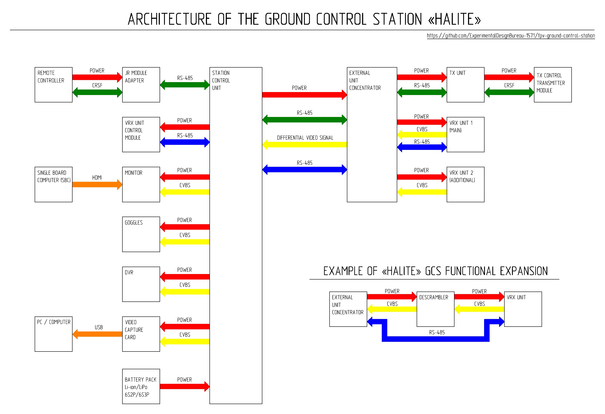

[🇺🇸 Read in English](README_EN.md) | [🇺🇦 Читати Українською](README.md)

# «HALITE» Ground Control Station

The «HALITE» Ground Control Station (GCS) for FPV drones is a modular system designed for reconfiguration based on specific mission requirements and operational conditions.

The station's architecture is built on the principle of functional separation of components, allowing for scalability and feature expansion by integrating additional modules without altering the base structure.

The system was developed based on practical combat experience, considering component availability, maximum support for domestic manufacturers, and the feasibility of reproduction by technical personnel in field workshops, civilian, or volunteer settings with average equipment.

It is recommended to follow this assembly and manufacturing order:

1.	**[Universal Case and Station Body](Універсальний_кейс_та_корпус_станції/)**
2.	**[Station Control Unit](Блок_керування_станцією/)**
3.	**[Monitor Modification](Модернізація_монітора/)**
4.	**[External Unit](Виносний_блок/)**
5.	**[VRX Modules](Блоки_VRX/)**
6.	**[Control Subsystem](Підсистема%20керування/)**
7.	**[Cables](Кабелі/)**

HALITE GCS Assembly & Manufacturing Video Guide

*Click the image to watch the video on YouTube.*

When following the provided technical instructions and maintaining manufacturing standards, the final product ensures a level of mechanical durability, maintainability, and operational performance comparable to commercial-grade counterparts of a similar class. General views of the "HALITE" Ground Control Station are shown in the photographs below.

  

  

  

## License

The use of materials in this repository is governed by the License Agreement, which includes the following key provisions:

Materials are provided exclusively for technical, educational, research, or other non-commercial use.

- Manufacturing products based on these materials is permitted solely for non-commercial use, specifically for the defense needs of Ukraine.
- Any commercial use of the materials, their modifications, or products derived from them is prohibited without explicit written consent from DKB-1571.
- Re-distribution of these materials is not allowed. Only sharing links to the official EDB-1571 resources is permitted.
- Materials are provided on an "as is" basis. Users assume all risks associated with their use.
- Exclusive intellectual property rights to the materials belong to EDB-1571.

Please review the full version of the License Agreement in the LICENSE.md file within this repository.

---

This project was created based on practical combat experience in FPV system operations.

Engineer "Trolleybus" 

Donetsk region, Ukraine

2026
