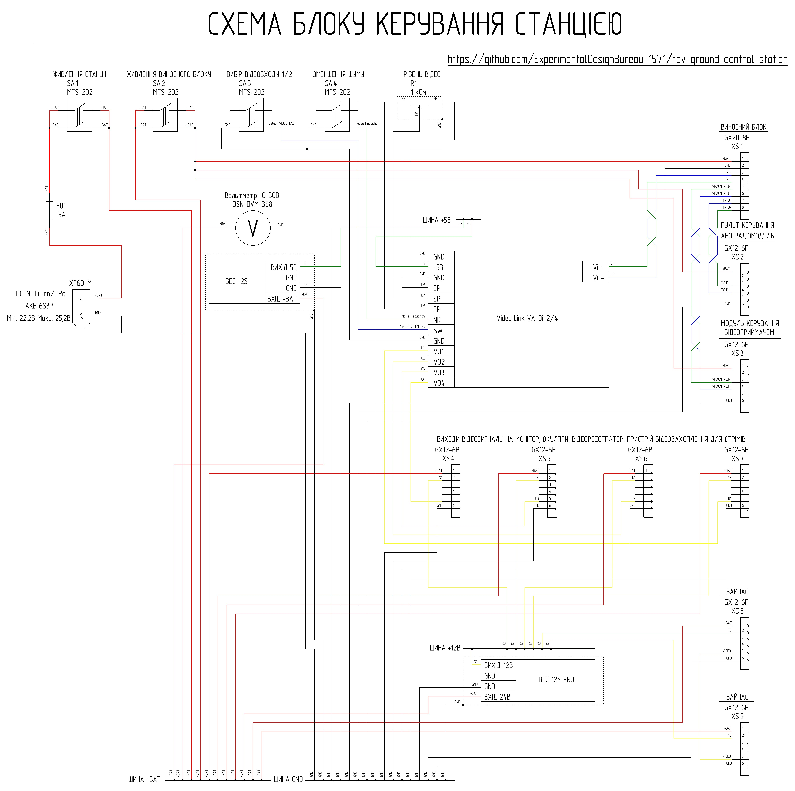
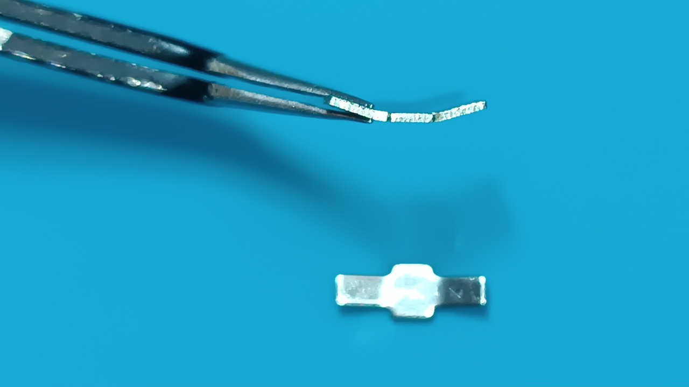

[🇺🇸 Read in English](README_EN.md) | [🇺🇦 Читати Українською](README.md)

# Station Control Unit

The Station Control Unit is used for power distribution and switching, signal concentration, and switching between the external unit and peripheral devices.

## Brief Technical Parameters of the Station Control Unit

| Parameter | Value | Note |
|----------|---------|---------|
| Input Voltage | 6S Li-ion/LiPo Battery (Min. 22.2V Max. 25.2V) | Via XT60 |
| Power Protection | 5A Fuse | FU1 |
| Power Switching | Toggle Switches | SA1 (main station power), SA2 (external unit power) |
| Power Bus | +BAT | Direct from battery |
| Auxiliary Busses | +12V, +5V | Formed by DC-DC converters |
| Max. Current on +12V Bus | Up to 3A | Total load |
| Number of Video Inputs | 1 (with selectable active video input on the external unit) | Toggle switch SA3 |
| Input Video Signal Type | Analog Differential | |
| Number of Video Outputs | 4 | XS4–XS7 |
| Output Video Signal Type | Analog Composite (CVBS) | |
| Video Processing | Amplification / Conversion / Branching / Filtering | VA-Di-2/4 Module |
| Video Level Adjustment | Yes | Potentiometer R1 |
| Video Noise Filtering | Yes | Toggle switch SA4 |
| BYPASS Mode | Yes | XS8–XS9 connectors |
| TX Interface | Yes | Via XS2 |
| VRX Control | Supported | Via XS3 |
| Cooling | Passive | Copper heatsinks + ventilation holes |
| Shielding | Partial | Voltage converters shielded by copper heatsinks |

### Interfaces

| Connector | Purpose | Main Signals | Note |
|--------|------------|----------------|----------|
| XS1 (GX20-8) | External unit connection | +BAT, GND, differential lines | Main communication channel |
| XS2 (GX12-6) | Control Remote (TX) | +BAT, GND, differential line | |
| XS3 (GX12-6) | VRX1 / external unit peripheral control | +BAT, GND, differential line | Optional |
| XS4 (GX12-6) | Video Output 1 | +BAT, +12V, GND, CVBS | Monitor, goggles, DVR, video capture device, etc. |
| XS5 (GX12-6) | Video Output 2 | +BAT, +12V, GND, CVBS | Monitor, goggles, DVR, video capture device, etc. |
| XS6 (GX12-6) | Video Output 3 | +BAT, +12V, GND, CVBS | Monitor, goggles, DVR, video capture device, etc. |
| XS7 (GX12-6) | Video Output 4 (monitor) | +BAT, +12V, GND, CVBS | Monitor connection |
| XS8 (GX12-6) | BYPASS (output) | +BAT, +12V, GND, CVBS | Direct connection |
| XS9 (GX12-6) | BYPASS (input) | +BAT, +12V, GND, CVBS | Signal source |
| XT60 | Power Input | +BAT, GND | Via fuse |

## Circuitry and Functionality of the Control Unit

Power is supplied to the control unit from a 6S3P Li-ion/LiPo battery through a FU1 5A fuse and enters the SA1 toggle switch. Turning on the SA1 switch supplies power to the +BAT bus, which provides the overall power for the ground station.

The external unit connects to the control unit via a cable through the XS1 connector. The control remote connects to the XS2 connector through a JR module with a CRSF -> RS-485 converter. The XS3 connector is used if remote control of the video receiver via twisted pair is required (note that this option is only available for the 1st video input of the external unit). If necessary, the twisted pair from the XS3 connector can be used to transmit control signals to other peripheral devices of the external unit. Power to connectors XS1, XS2, and XS3 is supplied from the +BAT bus through the SA2 toggle switch.

Connection of peripheral video devices (monitor, goggles, DVR, video capture device, etc.) is done through connectors XS4, XS5, XS6, and XS7. The XS7 connector is reserved for the station's standard monitor. Power to connectors XS4, XS5, XS6, and XS7 is supplied from the +BAT and +12V buses. The video signal to these connectors comes from an active amplifier-splitter that is powered by the +5V bus. It features the ability to select the active video input on the external unit (SA3 switch), noise reduction for strong interference (SA4 switch), and video level adjustment via the R1 variable resistor (video level).

If you need to supply the video signal directly to the monitor, you can use the "BYPASS" (XS8 and XS9 connectors). For this, the monitor is connected to XS8, and the video source to XS9. Power to connectors XS8 and XS9 is supplied from the +BAT and +12V buses.

Power to the +12V and +5V buses comes from voltage converters. Heat dissipation from the converters is carried out by two copper heatsinks via a silicone thermal interface. The copper heatsinks are connected to the GND common wire and, together with ceramic capacitors at the voltage converter outputs, minimize parasitic interference from converter operation. The total long-term load on the +12V bus through connectors XS4, XS5, XS6, XS7, XS8, and XS9 should not exceed 3A.

The station control unit has a high component density and involves working with different voltage levels. Successful assembly requires skills in reading schematic diagrams and experience in performing medium-complexity assembly work.

## List of Required Components for Manufacturing One Control Unit

| Name | Quantity | Note |
| :--- | :--- | :---: |
| Toggle switch 100DP1T1B1M1QEH or widely available MTS-202 6 pin ON-ON | 4 pcs | SA1-SA4 (note that widely available switches need modification for reliable switching!) |
| 1 kOhm Potentiometer WH148 | 1 pc | Video level regulator |
| Knob for WH148 potentiometer | 1 pc | |
| VideoLink VA-Di-2/4 Video Amplifier-Splitter | 1 pc | Ukrainian-made module [Purchase VideoLink VA-Di-2/4 from manufacturer](https://sezam.video/shop/videopidsilyuvach-videolink-va-di-24/) |
| GUTI ELECTRONICS BEC12S-PRO Voltage Converter | 1 pc | Ukrainian analog of Matek BEC 12S PRO [Purchase GUTI ELECTRONICS BEC12S-PRO from manufacturer](https://prom.ua/ua/p2814749849-otechestvennyj-analog-matek.html) |
| GUTI ELECTRONICS mBEC12S Voltage Converter | 1 pc | Ukrainian analog of Matek BEC 12S [Purchase GUTI ELECTRONICS mBEC12S from manufacturer](https://prom.ua/ua/p2814749850-otechestvennyj-analog-matek.html) |
| Voltmeter DSN-DVM-368 0-30V | 1 pc | |
| GX20-8 pin Panel Plug (male) | 1 pc | XS1 |
| GX12-6 pin Panel Plug (male) | 8 pcs | XS2-XS9 |
| XT60E-M Connector | 1 pc | |
| Fuse holder FH-501 (KLS5-701) | 1 pc | |
| 5A Standard FT Fuse | 1 pc | |
| 0.8 mm thick sheet copper | 134 mm x 40 mm | Cooling heatsinks for power distribution module |
| 1.5 mm Silicone thermal pad 6W/m.k | 84 mm x 24 mm | Heat dissipation from converters to heatsinks |
| 1 mm Silicone thermal pad 6W/m.k | 18 mm x 16 mm | Heat dissipation from converters to heatsinks |
| 1.5 mm single-sided PCB fiberglass | 35 mm x 17 mm | Power bus board in the distribution module |
| 26 AWG copper wire, silicone insulation, Black | 760 mm | |
| 26 AWG copper wire, silicone insulation, Red | 250 mm | |
| 26 AWG copper wire, silicone insulation, Yellow | 490 mm | |
| 26 AWG copper wire, silicone insulation, Blue | 410 mm | |
| 26 AWG copper wire, silicone insulation, Green | 660 mm | |
| 20 AWG copper wire, silicone insulation, Black | 1540 mm | |
| 20 AWG copper wire, silicone insulation, Red | 2140 mm | |
| 20 AWG copper wire, silicone insulation, Yellow | 1060 mm | |
| M2x8 DIN 7985 Screw | 14 pcs | |
| M2.5x8 DIN 965 Screw | 2 pcs | |
| M2.5x12 DIN 7985 Screw | 2 pcs | |
| M3x8 DIN 7985 A2 Screw | 2 pcs | |
| M3x16 DIN 7985 A2 Screw | 4 pcs | |
| M2 DIN 125 Washer | 14 pcs | |
| M2.5 DIN 125 Washer | 2 pcs | |
| M3 DIN 125 Washer | 2 pcs | |
| M2 DIN 934 Nut | 14 pcs | |
| M2.5 DIN 934 Nut | 2 pcs | |
| M3 DIN 934 Nut | 6 pcs | |
| 2x8 DIN 7982 Screw | 8 pcs | |
| Part 1 - 3D print | 1 pc | |
| Part 2 - 3D print | 1 pc | |
| Part 3 - 3D print | 1 pc | |
| Part 4 - 3D print | 1 pc | |

## 3D Printing Settings and Material

| Parameter | Value |
| :---: | :---: |
| Perimeters | 4 |
| Top/Bottom solid layers | 5 |
| Infill density | 40% |
| Infill pattern | Gyroid |
| Supports | Tree |

Material: coPET black MonoFilament

## Modernization of MTS-202 Toggle Switches (6 pin, ON-ON)

High-quality toggle switches can be hard to find, but widely available models can be easily adapted for reliable operation. This modernization improves switching reliability.

### Workflow:

1. **Disassembly:** Carefully disassemble the toggle switch by bending back the metal tabs of the body.

2. **Contact Preparation:** Remove the rocker arms (moving contacts) and bend them slightly to ensure reliable switching.

 

3. **Lubrication:** Apply a small amount of thick silicone grease to the plastic plunger to reduce wear and increase smoothness.
4. **Assembly:** Reassemble in reverse order, tightly fixing the metal cover with the tabs.
5. **Verification:** Verify the switch operation using a multimeter.

## Hardware Usage Detail

| Name | Type/Size | Quantity | Note |
| :--- | :--- | :---: | :---: |
| Screw | M2x8 DIN 7985 | 4 pcs | Attaching power bus board to Part 4 |
| Screw | M2x8 DIN 7985 | 10 pcs | Attaching heatsinks to Part 4 |
| Screw | M2.5x8 DIN 965 | 2 pcs | Attaching XT60 power connector to Part 1 |
| Screw | M2.5x12 DIN 7985 | 2 pcs | Attaching voltmeter to Part 2 |
| Screw | M3x8 DIN 7985 A2 | 2 pcs | Attaching fuse holder to Part 1 |
| Screw | M3x16 DIN 7985 A2 | 4 pcs | Attaching power distribution module to Part 3 |
| Washer | M2 DIN 125 | 4 pcs | Attaching power bus board to Part 4 |
| Washer | M2 DIN 125 | 10 pcs | Attaching heatsinks to Part 4 |
| Washer | M2.5 DIN 125 | 2 pcs | Attaching voltmeter to Part 2 |
| Washer | M3 DIN 125 | 2 pcs | Attaching power distribution module to Part 3 |
| Nut | M2 DIN 934 | 4 pcs | Attaching power bus board to Part 4 |
| Nut | M2 DIN 934 | 10 pcs | Attaching heatsinks to Part 4 |
| Nut | M2.5 DIN 934 | 2 pcs | Attaching voltmeter to Part 2 |
| Nut | M3 DIN 934 | 2 pcs | Attaching fuse holder to Part 1 |
| Nut | M3 DIN 934 | 4 pcs | Attaching power distribution module to Part 3 |
| Screw | 2x8 DIN 7982 | 4 pcs | Attaching Part 2 to Part 1 |
| Screw | 2x8 DIN 7982 | 4 pcs | Attaching Part 3 to Part 1 |

## Wire Usage Detail

XS1
| Type | Length | Note |
| :--- | :--- | :---: |
| 20 AWG black | 100 mm | XS1 - power distribution module GND bus |
| 20 AWG red | 160 mm | XS1 - SA2 |
| 26 AWG green | 110 mm | XS1 - VA-Di-2/4 |
| 26 AWG blue | 110 mm | XS1 - VA-Di-2/4 |

XS2
| Type | Length | Note |
| :--- | :--- | :---: |
| 20 AWG black | 140 mm | XS2 - power distribution module GND bus |
| 20 AWG red | 110 mm | XS2 - SA2 |
| 26 AWG green | 100 mm | XS2 - XS1 |
| 26 AWG blue | 100 mm | XS2 - XS1 |

XS3
| Type | Length | Note |
| :--- | :--- | :---: |
| 20 AWG black | 140 mm | XS3 - power distribution module GND bus |
| 20 AWG red | 110 mm | XS3 - SA2 |
| 26 AWG green | 100 mm | XS3 - XS1 |
| 26 AWG blue | 100 mm | XS3 - XS1 |

XS4
| Type | Length | Note |
| :--- | :--- | :---: |
| 20 AWG black | 150 mm | XS4 - power distribution module GND bus |
| 20 AWG red | 150 mm | XS4 - power distribution module +BAT bus |
| 20 AWG yellow | 150 mm | XS4 - power distribution module +12V bus |
| 26 AWG yellow | 110 mm | XS4 - VA-Di-2/4 |

XS5
| Type | Length | Note |
| :--- | :--- | :---: |
| 20 AWG black | 150 mm | XS5 - power distribution module GND bus |
| 20 AWG red | 150 mm | XS5 - power distribution module +BAT bus |
| 20 AWG yellow | 150 mm | XS5 - power distribution module +12V bus |
| 26 AWG yellow | 100 mm | XS5 - VA-Di-2/4 |

XS6
| Type | Length | Note |
| :--- | :--- | :---: |
| 20 AWG black | 160 mm | XS6 - power distribution module GND bus |
| 20 AWG red | 160 mm | XS6 - power distribution module +BAT bus |
| 20 AWG yellow | 160 mm | XS6 - power distribution module +12V bus |
| 26 AWG yellow | 100 mm | XS6 - VA-Di-2/4 |

XS7
| Type | Length | Note |
| :--- | :--- | :---: |
| 20 AWG black | 170 mm | XS7 - power distribution module GND bus |
| 20 AWG red | 170 mm | XS7 - power distribution module +BAT bus |
| 20 AWG yellow | 170 mm | XS7 - power distribution module +12V bus |
| 26 AWG yellow | 110 mm | XS7 - VA-Di-2/4 |

XS8
| Type | Length | Note |
| :--- | :--- | :---: |
| 20 AWG black | 170 mm | XS8 - power distribution module GND bus |
| 20 AWG red | 170 mm | XS8 - power distribution module +BAT bus |
| 20 AWG yellow | 170 mm | XS8 - power distribution module +12V bus |
| 26 AWG yellow | 70 mm | XS8 - XS9 |

XS9
| Type | Length | Note |
| :--- | :--- | :---: |
| 20 AWG black | 160 mm | XS9 - power distribution module GND bus |
| 20 AWG red | 160 mm | XS9 - power distribution module +BAT bus |
| 20 AWG yellow | 160 mm | XS9 - power distribution module +12V bus |

XT60
| Type | Length | Note |
| :--- | :--- | :---: |
| 20 AWG black | 100 mm | XT60 - power distribution module GND bus |
| 20 AWG red | 50 mm | XT60 - fuse holder |

Fuse Holder
| Type | Length | Note |
| :--- | :--- | :---: |
| 20 AWG red | 120 mm | Fuse holder - SA1 |

Voltmeter
| Type | Length | Note |
| :--- | :--- | :---: |
| 26 AWG black | 170 mm | Voltmeter - power distribution module GND bus |
| 26 AWG red | 170 mm | Voltmeter - power distribution module +BAT bus |

SA1
| Type | Length | Note |
| :--- | :--- | :---: |
| 20 AWG red | 170 mm | SA1 - power distribution module +BAT bus |
| 20 AWG red | 100 mm | SA1 - SA1 jumpers |

SA2
| Type | Length | Note |
| :--- | :--- | :---: |
| 20 AWG red | 170 mm | SA2 - power distribution module +BAT bus |
| 20 AWG red | 100 mm | SA2 - SA2 jumpers |

SA3
| Type | Length | Note |
| :--- | :--- | :---: |
| 26 AWG black | 100 mm | SA3 - VA-Di-2/4 |
| 26 AWG black | 30 mm | SA3 - SA4 |
| 26 AWG blue | 100 mm | SA3 - VA-Di-2/4 |

SA4
| Type | Length | Note |
| :--- | :--- | :---: |
| 26 AWG green | 100 mm | SA4 - VA-Di-2/4 |

R1
| Type | Length | Note |
| :--- | :--- | :---: |
| 26 AWG black | 30 mm | R1 - VA-Di-2/4 |

VA-Di-2/4
| Type | Length | Note |
| :--- | :--- | :---: |
| 26 AWG black | 170 mm | VA-Di-2/4 - power distribution module GND bus |
| 26 AWG green | 170 mm | VA-Di-2/4 - power distribution module +5V bus |

Power Distribution Module
| Type | Length | Note |
| :--- | :--- | :---: |
| 26 AWG black | 80 mm | Large heatsink - power distribution module GND bus |
| 26 AWG black | 80 mm | Small heatsink - power distribution module GND bus |
| 26 AWG black | 80 mm | 12S voltage converter - power distribution module GND bus |
| 26 AWG red | 80 mm | 12S voltage converter - power distribution module +BAT bus |
| 26 AWG green | 80 mm | 12S voltage converter - power distribution module +5V bus |
| 20 AWG black | 100 mm | 12S PRO voltage converter - power distribution module GND bus |
| 20 AWG red | 100 mm | 12S PRO voltage converter - power distribution module +BAT bus |
| 20 AWG yellow | 100 mm | 12S PRO voltage converter - power distribution module +12V bus |
