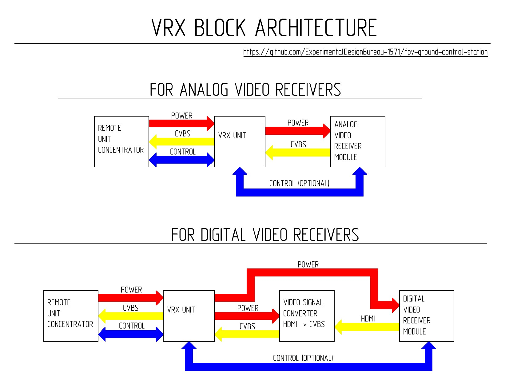

[🇺🇸 Read in English](README_EN.md) | [🇺🇦 Читати Українською](README.md)

# VRX Units

This section contains documentation, 3D models, schematic diagrams, and manufacturing instructions for the interchangeable video signal receiving units (VRX units) used as part of the ground control station. Each VRX unit is a functionally complete module designed to operate in a specific frequency range, transmission standard, or with a specific type of video receiving equipment.

## Purpose

VRX units provide:
- Video signal reception
- Transmission of the output video signal to the ground station's communication lines
- Mechanical integration of video receiving equipment into the station's remote unit
- Unified connection of power and signal lines

## Architecture and Implementation Details

### The architecture supports the use of:
- Analog video receivers
- Digital video receiving systems in combination with a video signal converter
- Video receiver control via the ground station's communication lines

### Implementation Features:
- All VRX units have a unified connection to the remote unit concentrator
- New VRX units are integrated into the ground station without changing the architecture of other station subsystems
- Each VRX unit is designed for a specific type of video receiving equipment or transmission standard
- The design allows for the replacement of VRX units without modifying other station components
