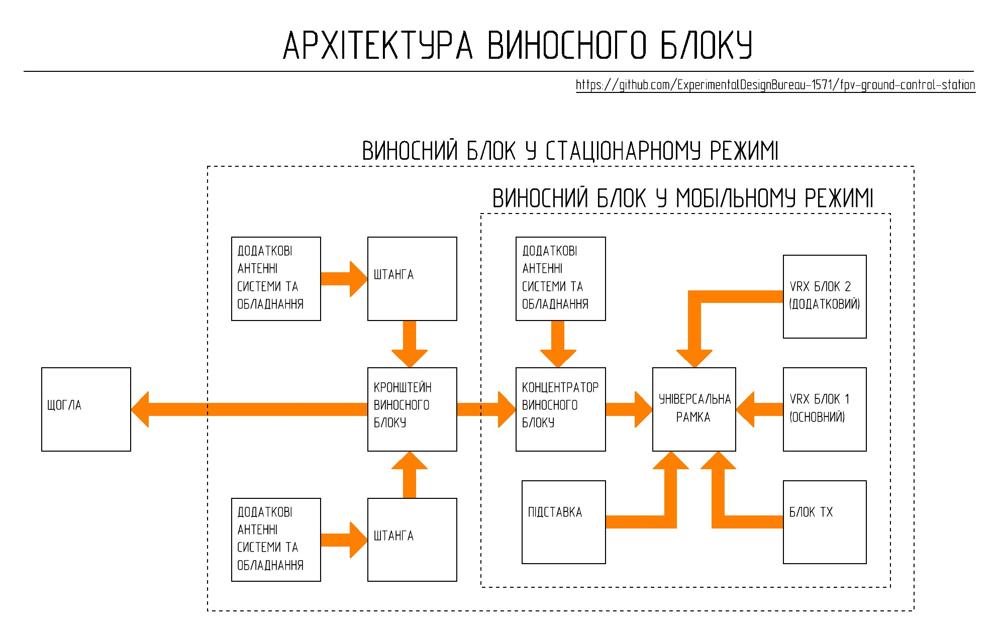

[🇺🇸 Read in English](README_EN.md) | [🇺🇦 Читати Українською](README.md)

# Remote Unit

The remote unit is a functional node of the ground control station designed for the integration of video signal reception systems, control signal transmission, as well as antenna-feeder equipment. The remote unit is a modular platform and allows for configuration changes depending on the task, type of video system, or operating conditions.

The design of the remote unit provides:
- mechanical and electrical integration of remote unit peripheral devices
- use of interchangeable TX and VRX blocks
- configuration changes of peripheral devices without changing the architecture of other station subsystems
- placement of high-frequency modules outside the station control unit
- integration of additional antenna systems
- operation in mobile and stationary modes
- mounting on a mast or other supporting structures
- rapid transition of the station between transport and working positions

## Operating Modes

### Mobile Mode

The remote unit can be used without mounting on a mast when operating in high-mobility conditions or when line-of-sight is available.

### Stationary Mode

To improve signal reception and transmission conditions, the remote unit can be mounted on a mast using a bracket together with additional antenna systems.

### Note

It is recommended to follow the order below for manufacturing the remote unit:

1. **[Remote unit concentrator](Концентратор_виносного_блоку/)**
2. **[Universal frame](Універсальна_рамка/)**
3. **[Remote unit bracket](Кронштейн%20виносного%20блоку/)**
