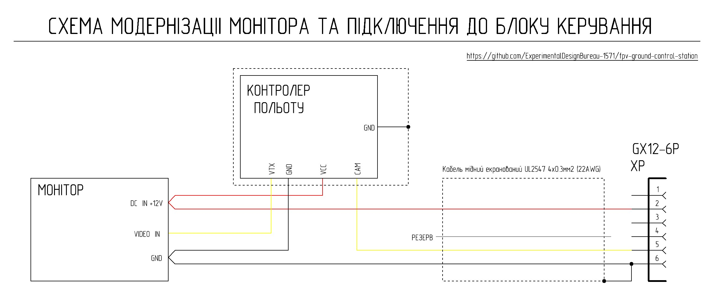

[🇺🇸 Read in English](README_EN.md) | [🇺🇦 Читати Українською](README.md)

# Monitor Modernization

A universal monitor with a 10.1-inch screen diagonal is used as the standard information display device in the ground station. The use of this type of monitor is justified by its wide availability in terms of both stock and price, as well as its set of technical characteristics. Models are available with both an analog video input and additional inputs, including a digital HDMI input. Using a monitor with an additional digital HDMI video input in the ground station expands usage possibilities; for example, it is possible to directly connect modules such as Walksnail Avatar VRX and Walksnail Ascent VRX, or single-board computers (SBC) like Raspberry Pi.

This monitor has a "blue screen" mode that activates if the video signal on the active video input is absent or has significant distortion. When using the digital HDMI video input, this plays no role, but when using the analog video input, the ability to see the picture through noise is critically important.

## Monitor Modernization - Theoretical Information

The "blue screen" problem can be solved by a slight modernization of the monitor, which consists of additional video signal processing by the AT7456E chip. To simplify the modernization process as much as possible, a flight controller where it is already installed with all necessary circuitry is used. The expediency of using a flight controller specifically is argued by its wide availability in any field workshop.

How it works:
The output signal from the video receiver undergoes processing by the AT7456E chip. The AT7456E chip restores and stabilizes synchronization, forming a correct composite video signal at the output even with a significant level of interference.

For the monitor, such a signal always looks "correct". Even if the image from the drone is filled with noise or has almost disappeared, the monitor does not switch to "blue screen" mode.

Result: we see the picture until the very end without the monitor switching to a "blue screen," which is critically important during strong interference.

 
 
 

If the signal consists mostly of "relic noise" ("snow"), the monitor may still switch to "blue screen" mode. In such a case, goggles can be connected to the station control unit via the XS4, XS5, or XS6 connectors, although it is unlikely that a useful signal can be extracted from continuous noise in them either.

The constant appearance of the "AV 1 PAL" inscription against a background of strong noise is a sign that the system is operating at its maximum limit. This is a signal to the operator: synchronization stabilization by the AT7456E chip is still holding, but at any moment the monitor may switch to "blue screen" mode due to noise overloading the chip's input.

As soon as at least a minimal identifiable useful signal appears in the noise stream, the AT7456E chip will instantly restore synchronization, and the image on the monitor will reappear.

## Monitor Modernization - Practical Implementation

Practical implementation consists of mounting the following scheme:

Structurally, the flight controller is placed inside the monitor housing and secured using M3 screws and nuts.

Given the operation in an enclosed space, it is desirable to use a copper heatsink to stabilize the temperature conditions of the AT7456E chip and the flight controller's microcontroller; heat dissipation to this heatsink occurs through a silicone thermal interface. The drawing of the copper heatsink is provided below.

The copper heatsink is connected to the common wire and forms additional shielding for the AT7456E chip. The connection of the UL2547 4x0.3mm2 (22AWG) cable shield to the common wire is performed only on the connector side to prevent a ground loop.

  

**Additional important information:** be sure to set the PAL standard in the monitor settings, the flight controller's OSD menu, and the camera's output signal settings. For additional monitoring of the +12V bus voltage that powers the monitor, you can configure the display of this voltage in the flight controller's OSD menu settings. Considering the operating conditions, it is desirable to protect the LCD display with a hydrogel film, which is convenient to do when the monitor is disassembled.

## List of Required Components for the Modernization of One Monitor

| Name | Quantity | Note |
|:---: | :---: | :---: |
| Flight controller with AT7456E | 1 pc | | 
| M3*8 mm damping standoff for flight controller | 4 pcs | | 
| M3*4 mm damping standoff for flight controller | 4 pcs | | 
| M3x18 DIN 7985 A2 Screw | 4 pcs | Fastening the flight controller and cooling radiator to the monitor housing | 
| M3 DIN 934 Nut | 4 pcs | Fastening the flight controller and cooling radiator to the monitor housing | 
| 4 mm Silicone thermal pad 3.5W/m.k | 25 mm x 20 mm | Heat dissipation from AT7456E and STM32 chips to the copper radiator | 
| 0.8 mm thick sheet copper | 37.5 mm x 37.5 mm | Cooling radiator | 
| 26 AWG silicone insulated copper wire (Black) | 310 mm | cable UL2547 -> FC = 120 mm; FC -> monitor = 210 mm | 
| 26 AWG silicone insulated copper wire (Yellow) | 330 mm | FC -> monitor = 210 mm; FC -> copper radiator = 100 mm |
| 26 AWG silicone insulated copper wire (Red) | 100 mm | monitor -> FC |
| UL2547 4x0.3mm2 (22AWG) shielded copper cable | 365 mm | Length distributed as follows: 85 mm in the monitor and 280 mm outside it |
| GX12-6 pin Cable Socket (female) | 1 pc | |
| Hydrogel film for monitor protection | 225 mm x 128 mm | |
