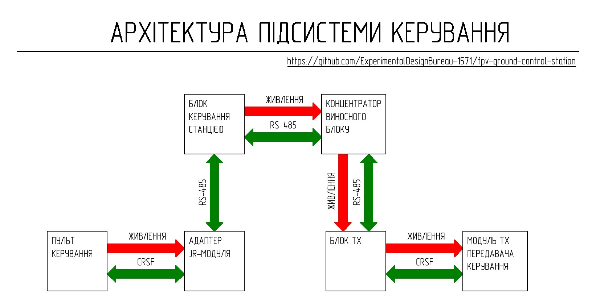

[🇺🇸 Read in English](README_EN.md) | [🇺🇦 Читати Українською](README.md)

# Control Subsystem

The control subsystem provides two-way data exchange through the ground station's communication lines using the RS-485 standard between the operator's remote controller and the control transmitter installed in the ground station's remote unit.

The control subsystem includes:
- JR Module Adapter (on the remote controller side)
- TX Unit (on the remote unit side)

## Short Technical Parameters

| Parameter | Value | Note |
|----------|---------|---------|
| Control protocol | CRSF | Via S.Port |
| Transmission interface | Differential signal of RS-485 standard | Noise-resistant, long lines |
| Data transmission channel | Ground station communication lines | Maximum length depends on the cable type |
| Operating mode | Two-way | Control + telemetry |
| JR module adapter power supply | 5–8.4 V | From the remote controller |
| TX unit power supply | From the remote unit concentrator | Via XS2 |
| TX control transmitter module power supply | 8V | From the TX unit |
| TX unit output voltage via XS3 connector | 8V | Maximum long-term current 2A |
| Cooling | Passive | Radiators + ventilation holes |
| Shielding | Partial | |

## Operating Principle and Architecture

The control signal from the remote controller goes to the JR module adapter, where it is converted into a differential RS-485 signal. Then, the signal is transmitted through the ground station's communication lines to the TX unit, where reverse conversion into a CRSF protocol signal occurs before being fed to the control transmitter. The return channel (telemetry) works similarly in the opposite direction.

Detailed implementation of each device in the control subsystem is provided in the relevant sections:

* **[JR Module Adapter](Адаптер%20JR-модуля/)**
* **[TX Unit](Блок%20TX/)**
