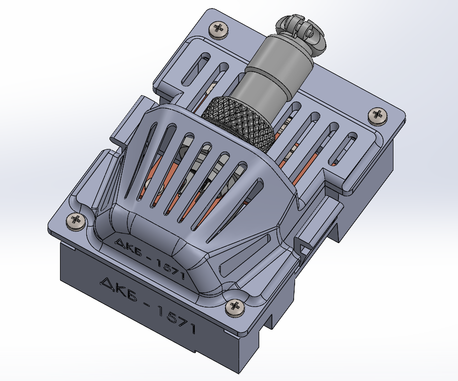
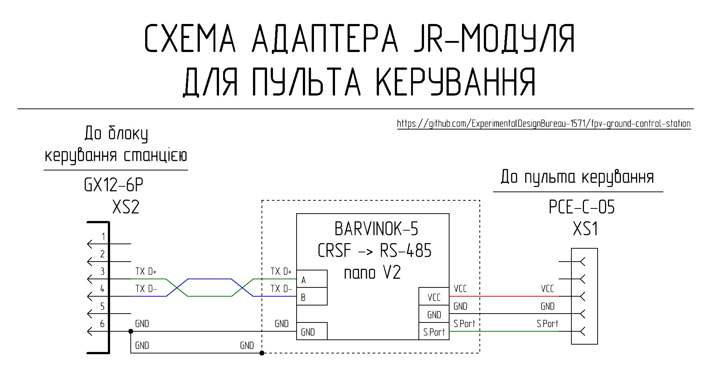

[🇺🇸 Read in English](README_EN.md) | [🇺🇦 Читати Українською](README.md)

# JR Module Adapter

The JR module adapter provides the ability to connect a remote controller with a JR-compatible bay to the station control unit for subsequent two-way data exchange with the control transmitter located on the ground station's remote unit.

## Short Technical Parameters

| Parameter | Value | Note |
|----------|---------|---------|
| Control protocol | CRSF | Via S.Port |
| Transmission interface | Differential signal of RS-485 standard | |
| Operating mode | Two-way | Control + telemetry |
| JR module adapter power supply | 5–8.4 V | From the remote controller |
| Cooling | Passive | Radiators + ventilation holes |
| Shielding | Partial | |

### Interfaces

| Connector | Purpose | Main Signals | Note |
|--------|------------|----------------|----------|
| XS1 | Connection to the remote controller | +BAT, GND, CRSF | The remote controller must be equipped with a JR-compatible bay |
| XS2 | Connection to the station control unit | Differential signal of RS-485 standard, GND | |

## Circuitry and Functionality of the JR Module Adapter

The adapter is powered directly from the remote controller via the XS1 connector in the range of 5V–8.4V.

The high-speed signal from the remote controller via the S.Port output (CRSF protocol) of the XS1 connector is fed to the interface converter (BARVINOK-5 RS-485 nano V2.1 module), which converts it into a differential RS-485 standard signal and outputs it to the ground station communication lines via the XS2 connector.

Temperature stabilization is provided by a passive cooling system consisting of ventilation holes in the housing, a silicone thermal pad, and a copper heatsink. The heatsink is electrically connected to the common wire (GND), allowing it to function as an additional shield for protection against electromagnetic interference.

## List of Required Components for Manufacturing One JR Module Adapter

| Name | Quantity | Note |
| :--- | :--- | :---: |
| BARVINOK-5 RS-485 nano V2.1 interface converter module | 1 pc | Ukrainian-made module [purchase from the manufacturer](https://prom.ua/ua/p2693881056-adapter-port-485.html) |
| PCE-C-05 Connector | 1 pc | XS1 |
| GX12-6 pin Male Panel Mount Plug | 1 pc | XS2 |
| Double-sided prototyping PCB (2.54 mm pitch) | 30 mm x 70 mm | |
| 0.8 mm thick sheet copper | 25 mm x 28 mm | |
| 2 mm Silicone thermal pad 6W/m.k | 25 mm x 28 mm | |
| 26 AWG silicone insulated copper wire (Black) | 260 mm | |
| 26 AWG silicone insulated copper wire (Green) | 170 mm | |
| 26 AWG silicone insulated copper wire (Blue) | 170 mm | |
| M2x5 DIN 7985 Screw | 2 pcs | |
| M2x6 DIN 965 Screw | 3 pcs | |
| M2x10 DIN 7985 Screw | 9 pcs | |
| M2 DIN 125 Washer | 8 pcs | |
| M2 DIN 934 Nut | 14 pcs | |
| M3x8 DIN 965 Screw | 2 pcs | |
| M3 DIN 934 Nut | 2 pcs | |
| Part 1 - 3D print | 1 pc | |
| Part 2 - 3D print | 1 pc | |
| Part 3 - 3D print | 1 pc | |
| Part 4 - 3D print | 1 pc | |

## 3D Printing Settings and Material

| Parameter | Value |
| :---: | :---: |
| Perimeters | 4 |
| Top/Bottom solid layers | 5 |
| Infill density | 40% |
| Infill pattern | Gyroid |
| Supports | Tree |

Material: coPET black MonoFilament

## Hardware Usage Detail

| Name | Type/Size | Quantity | Note |
| :--- | :--- | :---: | :---: |
| Screw | M2x5 DIN 7985 | 2 pcs | Mounting the PCB with XS1 connector |
| Nut | M2 DIN 934 | 2 pcs | Mounting the PCB with XS1 connector |
| Screw | M2x10 DIN 7985 | 1 pc | Mounting the XS1 connector retainer |
| Nut | M2 DIN 934 | 1 pc | Mounting the XS1 connector retainer |
| Screw | M3x8 DIN 965 | 2 pcs | Mounting the BARVINOK-5 RS-485 nano V2.1 module |
| Nut | M3 DIN 934 | 2 pcs | Mounting the BARVINOK-5 RS-485 nano V2.1 module |
| Screw | M2x5 DIN 7985 | 4 pcs | Mounting the heatsink |
| Washer | M2 DIN 125 | 4 pcs | Mounting the heatsink |
| Nut | M2 DIN 934 | 4 pcs | Mounting the heatsink |
| Screw | M2x6 DIN 965 | 3 pcs | Mounting the internal bar to the module base |
| Nut | M2 DIN 934 | 3 pcs | Mounting the internal bar to the module base |
| Screw | M2x10 DIN 7985 | 4 pcs | Mounting the module cover to its base |
| Washer | M2 DIN 125 | 4 pcs | Mounting the module cover to its base |
| Nut | M2 DIN 934 | 4 pcs | Mounting the module cover to its base |

## Wire Usage Detail

| Type | Length | Note |
| :--- | :--- | :---: |
| 26 AWG black | 80 mm | XS1 - interface converter |
| 26 AWG green | 80 mm | XS1 - interface converter |
| 26 AWG blue | 80 mm | XS1 - interface converter |
| 26 AWG black | 90 mm | Interface converter - XS2 |
| 26 AWG green | 90 mm | Interface converter - XS2 |
| 26 AWG blue | 90 mm | Interface converter - XS2 |
| 26 AWG black | 90 mm | XS2 - heatsink |
