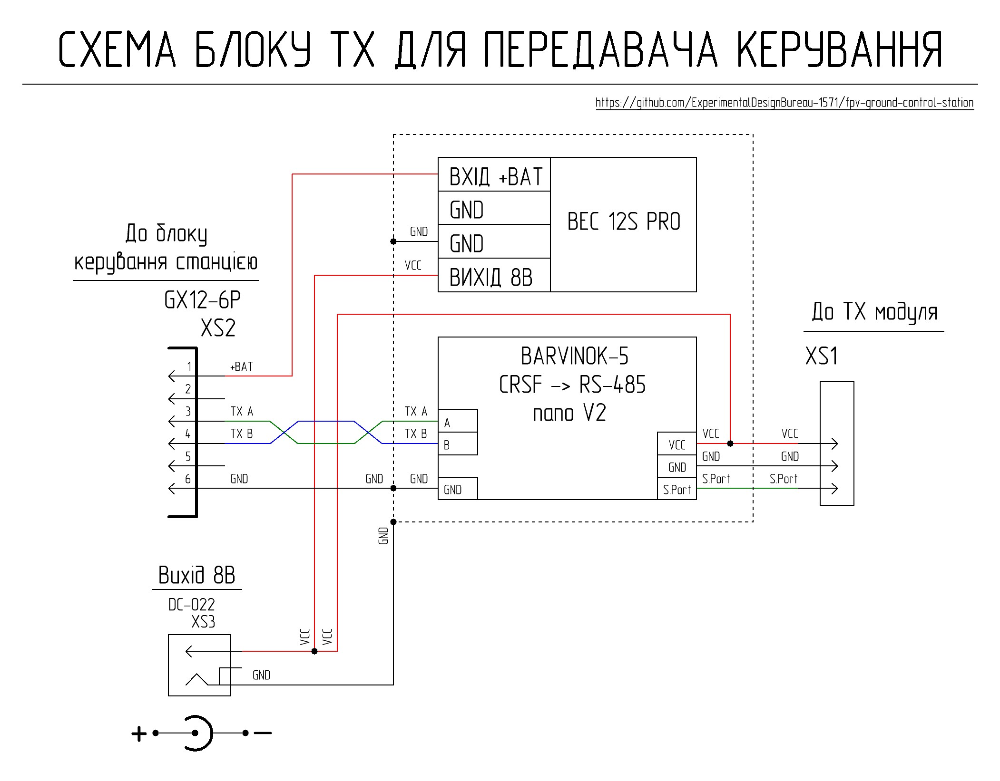
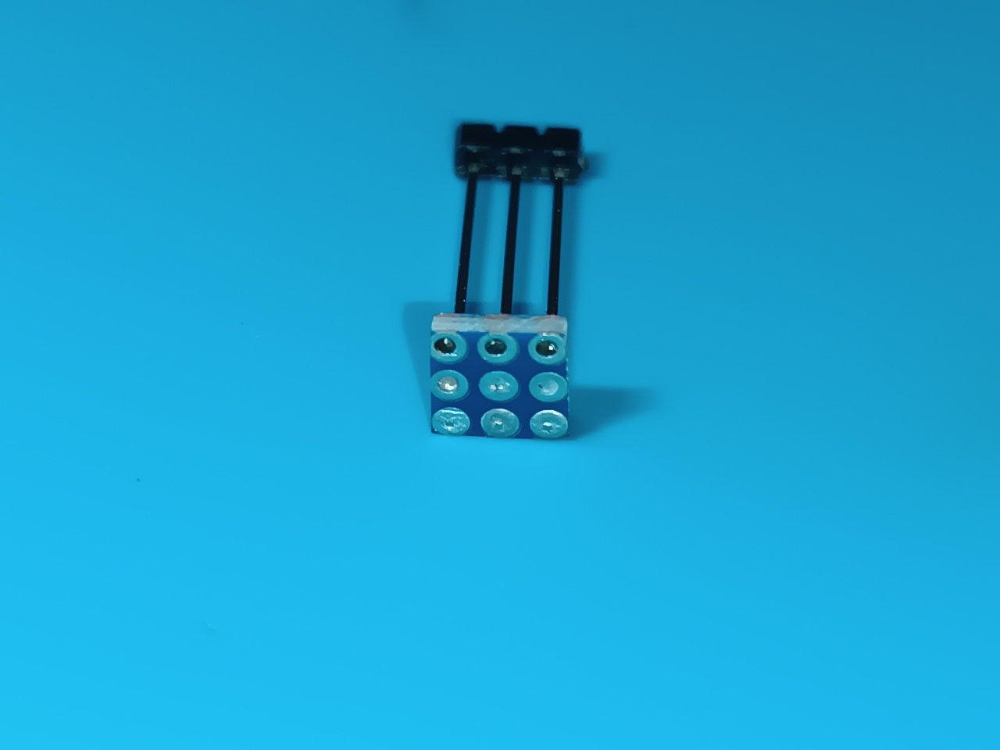
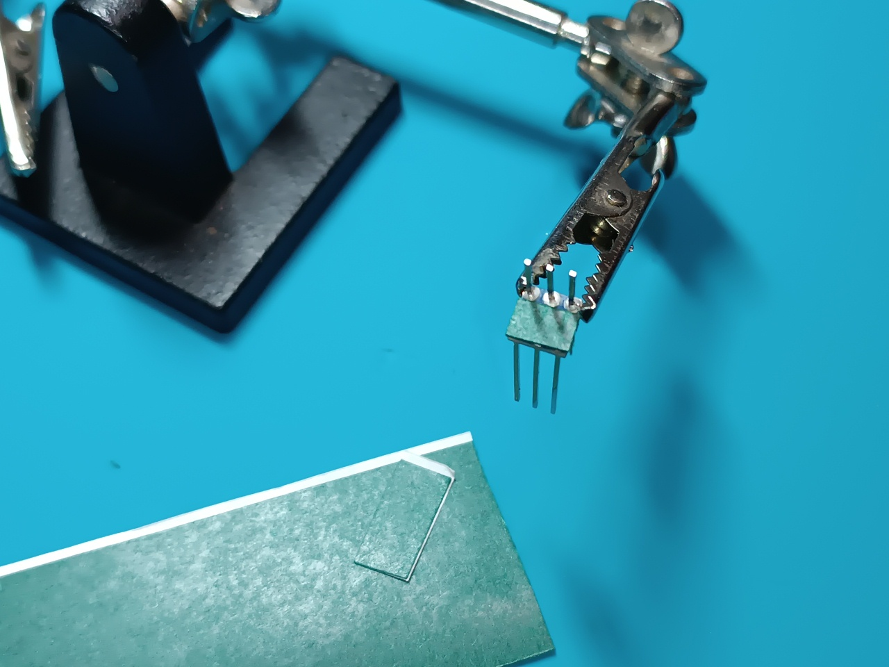

[🇺🇸 Read in English](README_EN.md) | [🇺🇦 Читати Українською](README.md)

# TX Unit

The TX unit provides the ability to connect a JR-compatible control transmitter module to the remote unit concentrator for subsequent two-way data exchange with the remote controller connected to the station control unit. The general view of the TX unit with the control transmitter installed is shown in the picture.

## Short Technical Parameters

| Parameter | Value | Note |
|----------|---------|---------|
| Control protocol | CRSF | Via S.Port |
| Transmission interface | Differential signal of RS-485 standard | |
| Operating mode | Two-way | Control + telemetry |
| TX unit power supply | From the remote unit concentrator | Via XS2 |
| TX control transmitter module power supply | 8V | From the TX unit |
| TX unit output voltage via XS3 connector | 8V | Maximum long-term current 2A |
| Cooling | Passive | Radiators + ventilation holes |
| Shielding | Partial | |

### Interfaces

| Connector | Purpose | Main Signals | Note |
|--------|------------|----------------|----------|
| XS1 | Connection of the control transmitter | VCC, GND, CRSF (S.Port) | Supports JR-compatible control transmitters |
| XS2 | Connection to the remote unit concentrator | +BAT, GND, differential signal of RS-485 standard | |
| XS3 | 8V power output | VCC, GND | For connecting high-power control transmitters |

## Circuitry and Functionality of the TX Unit for the Control Transmitter

The TX unit is powered by the remote unit concentrator. Voltage from the XS2 connector goes to the common wire bus, which uses a copper cooling heatsink, and to the voltage converter that forms an 8V voltage for powering the interface converter and the control transmitter (ensure your TX module supports 8V power). The 8V voltage is additionally output to the XS3 connector for the possibility of supplying power to high-power control transmitters that require external power. Note that a high-power control transmitter, when powered from the XS3 connector, must not have electrical contact with the GND pin of the XS1 connector to prevent a ground loop.

Two-way data exchange between the control transmitter and the remote controller is carried out according to the RS-485 standard through the ground station communication lines. Control signals via the XS2 connector enter the interface converter (BARVINOK-5 RS-485 nano V2.1 module), which converts the differential RS-485 signal into a high-speed CRSF protocol signal and feeds it to the control transmitter via the S.Port pin of the XS1 connector.

Temperature stabilization is provided by a passive cooling system consisting of ventilation holes in the housing, a silicone thermal pad, and a copper heatsink. The copper heatsink is used as a common wire (GND) bus, allowing it to function as an additional shield for protection against electromagnetic interference.

## List of Required Components for Manufacturing One TX Unit

| Name | Quantity | Note |
| :--- | :--- | :---: |
| BARVINOK-5 RS-485 nano V2.1 interface converter module | 1 pc | Ukrainian-made module [purchase from the manufacturer](https://prom.ua/ua/p2693881056-adapter-port-485.html) |
| GUTI ELECTRONICS BEC12S-PRO voltage converter | 1 pc | Ukrainian analog of Matek BEC 12S PRO [purchase from the manufacturer](https://prom.ua/ua/p2814749849-otechestvennyj-analog-matek.html) |
| GX12-6 pin Male Panel Mount Plug | 1 pc | XS2 |
| DC-022 Power Jack | 1 pc | XS3 |
| Pin header 1x40 pitch 2.54mm L=25mm | 3 pins | |
| Pin header 1x40 pitch 2.54mm L=15mm | 3 pins | |
| Double-sided prototyping PCB (2.54 mm pitch) | 30 mm x 70 mm | |
| Self-adhesive electrical insulating paper 0.2 mm | 30 mm x 30 mm | |
| 0.8 mm thick sheet copper | 26 mm x 57 mm | |
| 2 mm Silicone thermal pad 6W/m.k | 26 mm x 57 mm | |
| 20 AWG silicone insulated copper wire (Red) | 200 mm | |
| 20 AWG silicone insulated copper wire (Black) | 250 mm | |
| 26 AWG silicone insulated copper wire (Red) | 100 mm | |
| 26 AWG silicone insulated copper wire (Black) | 50 mm | |
| 26 AWG silicone insulated copper wire (Green) | 80 mm | |
| 26 AWG silicone insulated copper wire (Blue) | 80 mm | |
| M3x8 DIN 965 Screw | 2 pcs | |
| M3 DIN 934 Nut | 2 pcs | |
| M2x10 DIN 7985 Screw | 12 pcs | |
| M2 DIN 125 Washer | 12 pcs | |
| M2 DIN 934 Nut | 12 pcs | |
| Part 1 - 3D print | 1 pc | |
| Part 2 - 3D print | 1 pc | |

## 3D Printing Settings and Material

| Parameter | Value |
| :---: | :---: |
| Perimeters | 4 |
| Top/Bottom solid layers | 5 |
| Infill density | 40% |
| Infill pattern | Gyroid |
| Supports | Tree |

Material: coPET black MonoFilament

## XS1 Connector Manufacturing Process

The XS1 connector is formed by mounting long and short pins on the adapter board, which is made from a double-sided prototyping PCB. Long pins (L=25mm) are soldered so that they do not extend beyond the adapter board on the short pins' side. Thin copper wire is used as jumpers between the mounting holes of the prototyping board.

 

Short pins (L=15mm) are soldered in the opposite direction relative to the long pins.

On the short pins' side, three layers of self-adhesive electrical insulating paper are applied to the adapter board to protect against short circuits between the board's pads and the interface converter's common wire polygon.

Short pins are soldered to the interface converter; the excess length of the central (GND) and right (S.Port) pins is trimmed, while the left (VCC) pin is trimmed by approximately half, forming a point to which 8V from the voltage converter will be connected to power the interface converter and the control transmitter. Long pins are inserted into the corresponding holes of the unit base during the interface converter mounting.

 

## Hardware Usage Detail

| Name | Type/Size | Quantity | Note |
| :--- | :--- | :---: | :---: |
| Screw | M3x8 DIN 965 | 2 pcs | Mounting the BARVINOK-5 RS-485 nano V2.1 module |
| Nut | M3 DIN 934 | 2 pcs | Mounting the BARVINOK-5 RS-485 nano V2.1 module |
| Screw | M2x10 DIN 7985 | 6 pcs | Mounting the heatsink |
| Washer | M2 DIN 125 | 6 pcs | Mounting the heatsink |
| Nut | M2 DIN 934 | 6 pcs | Mounting the heatsink |
| Screw | M2x10 DIN 7985 | 6 pcs | Mounting the cover |
| Washer | M2 DIN 125 | 6 pcs | Mounting the cover |
| Nut | M2 DIN 934 | 6 pcs | Mounting the cover |

## Wire Usage Detail

| Type | Length | Note |
| :--- | :--- | :---: |
| 20 AWG black | 100 mm | GND bus (cooling heatsink) - XS2 |
| 20 AWG black | 50 mm | GND bus (cooling heatsink) - 12S PRO voltage converter |
| 26 AWG black | 50 mm | GND bus (cooling heatsink) - interface converter |
| 20 AWG black | 100 mm | GND bus (cooling heatsink) - XS3 |
| 26 AWG green | 80 mm | Interface converter - XS2 |
| 26 AWG blue | 80 mm | Interface converter - XS2 |
| 20 AWG red | 100 mm | 12S PRO voltage converter - XS2 |
| 20 AWG red | 100 mm | 12S PRO voltage converter - XS3 |
| 26 AWG red | 100 mm | Interface converter - XS3 |
